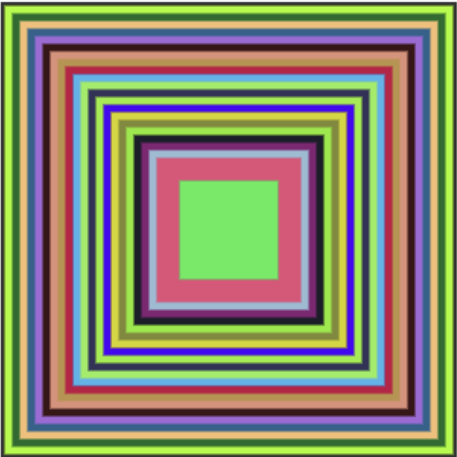
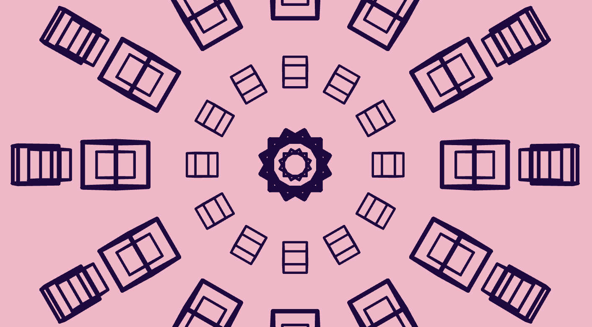

# jili0710_9103_tut09

My first reoisitory for IDEA9103

This is my first local change to the repo!

# Header 1
## Header 2
### Header 3

**Bold Text** or __Bold Text__
*Italic Text* or _Italic Text_

- Item 1
- Item 2
  - Subitem 2.1
  - Subitem 2.2

1. First Item
2. Second Item
3. Third Item

[Link Text](https://www.google.com)

# Quiz 8 – Creative Coding Design Research

## Part 1: Imaging Technique Inspiration

I was inspired by the Tesseract scene in *Interstellar* (2014), where Cooper enters a five-dimensional space visualized through layered glowing rectangles and repeated bookshelf structures. What fascinates me is how repetition and perspective are used to create a sense of depth and infinite extension within a confined frame. I’d like to incorporate this kind of **visually nested structure** into my project, possibly through animated recursive shapes or grid-based spatial layouts. I believe this approach can enhance the visual effect and spatial experience of my final creative coding work.

---

## Part 2: Coding Technique Exploration

To explore how repetition and spatial layering could be achieved in code, I looked into two p5.js examples:

1. [Square Fill](https://happycoding.io/tutorials/p5js/animation/square-fill): This sketch uses a loop to create nested, colorful rectangles. It offers a simple yet effective way to build visual depth and rhythm, similar to the layered look I want to explore.

   

2. [Orbit Control](https://p5js.org/examples/3d-orbit-control/): This sketch uses `WEBGL` and `orbitControl()` to enable interactive 3D rotation. I’m interested in using this to simulate multi-layered or dimensional navigation in my project.

   